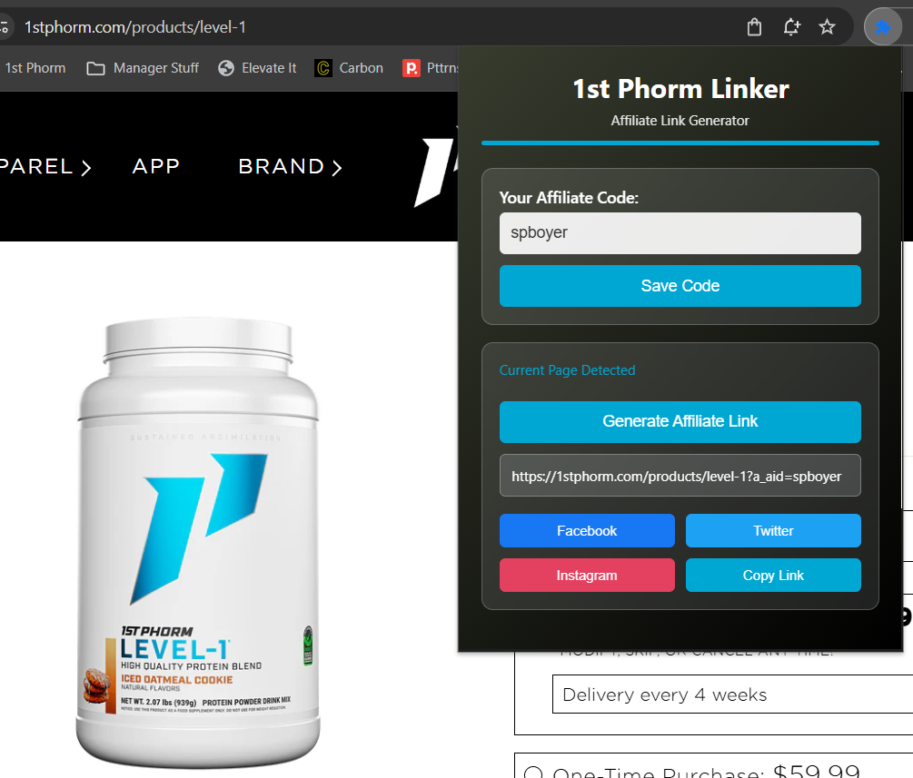

# 1st Phorm Affiliate Linker Browser Extension



A Chrome/Edge browser extension that helps you quickly create and share affiliate links for 1st Phorm products.

## Features

- **Easy Setup**: Save your affiliate code once and use it everywhere
- **Quick Link Generation**: One-click affiliate link creation on any 1st Phorm product page
- **Social Media Integration**: Direct sharing to Facebook, Twitter, and Instagram
- **Floating Action Button**: Always accessible quick-share button on product pages
- **Copy to Clipboard**: Easy copying for manual sharing

## Installation

### Option 1: Download Latest Release (Recommended)

1. **Download the latest release**:
   - Go to the [Releases page](https://github.com/yourusername/1stphormlinker/releases) *(replace `yourusername` with your actual GitHub username)*
   - Download the latest `1stphorm-linker-extension-v*.zip` file
   - Extract the zip file to a folder on your computer

2. **Install in Chrome**:
   - Open Chrome browser
   - Navigate to `chrome://extensions/`
   - Enable **Developer Mode** (toggle in top-right corner)
   - Click **"Load unpacked"** and select the extracted folder
   - Pin the extension to your toolbar for easy access

3. **Install in Microsoft Edge**:
   - Open Edge browser
   - Navigate to `edge://extensions/`
   - Enable **Developer Mode** (toggle in top-right corner)
   - Click **"Load unpacked"** and select the extracted folder
   - Pin the extension to your toolbar for easy access

### Option 2: Manual Installation (Development)

1. **Clone or download** this repository to your computer
2. Follow the same installation steps as above, but select the repository folder instead of an extracted release

### Setup Your Affiliate Code

1. Click the extension icon in your browser toolbar
2. Enter your affiliate code (e.g., "spboyer")
3. Click "Save Code"

## How to Use

### Method 1: Extension Popup
1. Navigate to any 1st Phorm product page
2. Click the extension icon
3. Click "Generate Affiliate Link"
4. Choose your sharing option:
   - **Facebook**: Opens Facebook share dialog
   - **Twitter**: Opens Twitter compose with link
   - **Instagram**: Copies link to clipboard (paste in your post)
   - **Copy Link**: Copies the affiliate link to clipboard

### Method 2: Quick Share Button (On Product Pages)
1. Navigate to any 1st Phorm product page
2. Look for the floating "Quick Share" button on the right side
3. Click it to see sharing options
4. Select your preferred platform

## Example

Your affiliate code: `spboyer`
Product URL: `https://1stphorm.com/products/peppermint-bark-combo-pack`
Generated link: `https://1stphorm.com/products/peppermint-bark-combo-pack?a_aid=spboyer`

## Browser Compatibility

This extension works with:
- **Google Chrome** (version 88+)
- **Microsoft Edge** (version 88+)
- **Other Chromium-based browsers** that support Manifest V3

## Technical Details

- **Manifest Version**: 3 (latest Chrome extension standard)
- **Permissions**: Active tab access and storage for affiliate code
- **Host Permissions**: Only works on 1stphorm.com domains
- **Storage**: Uses Chrome sync storage to save your affiliate code across devices
- **Framework**: Vanilla JavaScript (no external dependencies)

## Files Structure

```text
1stphormlinker/
├── manifest.json          # Extension configuration
├── popup.html             # Extension popup interface
├── popup.js               # Popup functionality
├── content.js             # Page interaction script
├── content.css            # Styling for page elements
├── icons/                 # Extension icons
├── images/                # Extension images
├── 1stphormlinker.png     # Extension screenshot
├── .github/workflows/     # GitHub Actions
│   └── release.yml        # Automated release creation
└── README.md              # This file
```

## Privacy

- Your affiliate code is stored locally in your browser
- No data is sent to external servers
- The extension only activates on 1stphorm.com pages

## Troubleshooting

**Extension not working?**
- Make sure you're on a 1st Phorm product page (URL contains `/products/`)
- Verify your affiliate code is saved in the extension popup
- Try refreshing the page

**Quick Share button not appearing?**
- Ensure you've saved your affiliate code
- Check that you're on a product page, not the homepage
- Disable and re-enable the extension if needed

## Development

### Creating a New Release

This project uses GitHub Actions to automatically create releases:

1. **Update the version** in `manifest.json`
2. **Commit your changes** to the main branch
3. **Merge or push** to the `release` branch
4. **GitHub Actions will automatically**:
   - Create a new release with the version from manifest.json
   - Package the extension files into a zip
   - Upload the zip as a release asset

### Local Development

1. Clone the repository
2. Make your changes
3. Test by loading the extension in developer mode
4. Submit a pull request

## Support

For issues or questions about this extension:

- Check the [GitHub Issues](https://github.com/yourusername/1stphormlinker/issues) page *(replace `yourusername` with your actual GitHub username)*
- Create a new issue if you encounter problems
- Contact the developer for affiliate program questions

## License

This extension is provided as-is for personal use with 1st Phorm affiliate programs.
